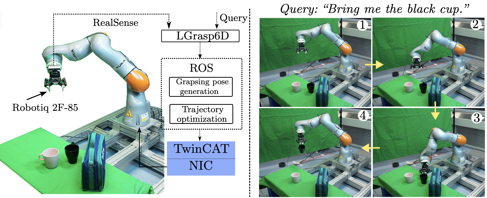

<div align="center">
  
# Language-Driven 6-DoF Grasp Detection Using Negative Prompt Guidance

[](https://arxiv.org/abs/2407.13842)
[](https://airvlab.github.io/grasp-anything/)

<h2 style="color: blue; font-size: 32px;">ECCV 2024 Oral</h2>



We address the task of language-driven 6-DoF grasp detection in cluttered point clouds. We introduce a novel diffusion model incorporating the new concept of negative prompt guidance learning. Our proposed negative prompt guidance assists in tackling the fine-grained challenge of the language-driven grasp detection task, directing the detection process toward the desired object by steering away from undesired ones.

</div>


## 1. Setup
Create new CONDA environment and install necessary packages

        conda create -n l6gd python=3.9
        conda activate l6gd
        conda install pip
        pip install -r requirements.txt

## 2. Download Grasp-Anything-6D dataset
You can request for our HuggingFace dataset at [our project page](https://airvlab.github.io/grasp-anything/).

## 3. Training
To start training the model, run

        python3 train.py --config <path to the config file>
Config files are stored in `./config`. Remember to change `dataset_path` in the config files after downloading the dataset. After training, log files and model weights will be saved to `./log`.

## 4. Detecting grasps
To detect grasp for test data, run

        python3 generate.py --config <path to the config file> --checkpoint <path to the trained model> --data_path <path to the downloaded dataset> --n_sample 64

The detected grasp poses will be saved to an ```all_data.pkl``` file in the corresponding log directory.

## 5. Evaluation
For evaluation, excecute

        python compute_metrics.py --data <path to all_data.pkl>

where `<path to all_data.pkl>` is the path to the file `all_data.pkl` generated after the step of detecting grasps.

## 6. Citation
If you find our work interesting or helpful for your research, please consider citing our paper as

        @inproceedings{nguyen2024language,
            title={Language-driven 6-dof grasp detection using negative prompt guidance},
            author={Nguyen, Toan and Vu, Minh Nhat and Huang, Baoru and Vuong, An and Vuong, Quan and Le, Ngan and Vo, Thieu and Nguyen, Anh},
            booktitle={ECCV},
            year={2024}
        }
